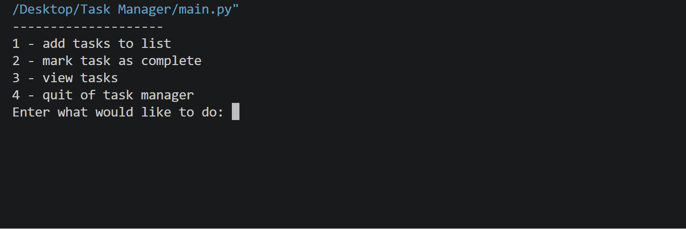

# 📝 Task Manager

A simple command-line task management application built with Python.

This project was developed to practice fundamental Python programming concepts while preparing for the PCEP (Certified Entry-Level Python Programmer) certification.

## 🎬 Demo



## ✨ Features

- Add new tasks
- Mark tasks as complete
- View all tasks
- Display task status
- Validate user input
- Handle invalid menu choices
- Handle invalid task selections

## 🛠️ Technologies & Concepts

- Python 3
- Lists
- Dictionaries
- Functions
- Loops
- Conditional statements
- Boolean values
- Input Validation
- Exception handling
- Enumerate

## 🚀 Getting Started

### Prerequisites

Make sure Python 3 is installed on your computer.

You can check your Python version using:

```bash
python --version
```

### Run the Application

1. Download or clone this repository.
2. Open a terminal in the project directory.
3. Run the following command:

```bash
python main.py
```

## 💻 Usage

After running the application, choose an option from the main menu:

```text
1 - add tasks to list
2 - mark task as complete
3 - view tasks
4 - quit of task manager
```

The application allows you to add tasks, view their status, and mark incomplete tasks as completed.

## 🎓 Learning Outcomes

This project demonstrates the practical application of fundamental Python concepts learned while preparing for the PCEP certification.

It reflects my understanding of core programming principles, including functions, lists, dictionaries, loops, conditional statements, Boolean values, input validation, and exception handling.

## 🔮 Future Improvements

- Save tasks to a file or database
- Add the ability to delete tasks
- Add the ability to edit tasks
- Add task priorities
- Add due dates
- Improve the command-line interface
- Add automated tests

## 📝 Note

Tasks are stored in memory and are reset when the application is closed.

## 📄 License

This project is for learning and educational purposes.
